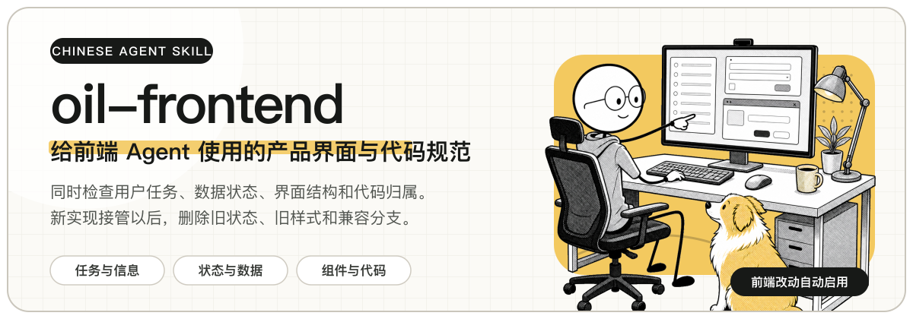

<p align="center">
  
</p>

<p align="center">
  给前端 Agent 使用的产品界面与代码规范。
</p>

<p align="center">
  <code>产品界面</code> · <code>数据状态</code> · <code>代码组织</code> · <code>历史清理</code> · <code>MIT</code>
</p>

## 这个 Skill 解决什么问题

`oil-frontend` 用于审查和修改产品前端。它把用户任务、页面信息、数据状态、组件边界和代码归属放在一起检查，避免 Agent 只调整局部样式，却继续留下重复状态、页面补丁和过时逻辑。

```text
用户任务 → 业务对象 → 权威数据源 → 状态与作用域 → 界面结构 → 代码归属 → 旧逻辑清理
```

这些环节需要围绕同一个业务对象保持一致。新实现接管以后，对应的旧组件、旧状态、旧样式和兼容分支也需要删除。

## 主要检查内容

| 常见问题 | 处理要求 |
| --- | --- |
| 页面展示 UUID、内部枚举等无法帮助识别对象的信息 | 只保留能够帮助识别、比较、判断、操作或理解结果的内容 |
| 显示 `3 selected` 一类状态文案，但它不影响任何操作 | 只有状态会影响当前判断、操作范围或下一步动作时才显示 |
| 同一业务数据同时存在于接口结果、全局状态、表单和局部组件 | 只保留一个权威数据源，可计算的值直接派生 |
| 异步请求开始后立即关闭弹窗，或者锁住整个页面 | 加载状态限制在最小范围；成功后关闭，失败时保留对象和操作上下文 |
| 把浏览页、详情页和候选列表都处理成表单 | 浏览时直接展示内容，编辑由明确操作触发，表单只收集当前任务需要的数据 |
| 共享组件出现问题以后，在页面 CSS 中继续覆盖样式 | 修改父布局、共享组件或稳定变体，让样式归属于对应组件或业务模块 |
| Hooks、函数、类型和样式散落在不同目录，或者重复实现 | 按业务归属组织；模块内部代码就近放置，稳定的跨模块能力再进入共享层 |
| 迁移完成以后仍然保留 fallback、legacy、旧类型和旧状态 | 确认新实现已经接管全部使用位置，然后删除旧路径 |

## 处理流程

1. 确认用户要完成的任务，以及什么结果代表任务已经完成。
2. 确认页面管理的业务对象、权威数据源和状态作用范围。
3. 删除无效信息、重复动作、伪状态、页面补丁和过时逻辑。
4. 按照浏览、比较、选择、编辑或批量配置等实际任务组织界面。
5. 修改数据流、父布局、共享组件或业务模块中真正产生问题的实现。
6. 更新全部使用位置，并删除已经被替代的组件、状态、样式和兼容分支。

## 安装

### Codex

```bash
git clone https://github.com/oil-oil/oil-frontend.git ~/.codex/skills/oil-frontend
```

### Claude Code

```bash
git clone https://github.com/oil-oil/oil-frontend.git ~/.claude/skills/oil-frontend
```

如果 Agent 使用其他 Skill 目录，把仓库克隆到对应目录即可。

## 使用

涉及产品前端的实现、修改、重构或评审时，Agent 可以自动启用。也可以明确点名：

```text
使用 $oil-frontend 审查这个产品前端的任务流程、数据来源、状态、界面结构和代码组织，并修复问题。
```

也可以明确限制任务范围：

```text
使用 $oil-frontend 只评审这个表单，不修改代码。
```

```text
使用 $oil-frontend 重构这个模块，统一 Hooks、类型和数据来源，并删除旧实现。
```

```text
使用 $oil-frontend 检查这个列表、详情和异步操作是否属于同一套真实状态。
```

## 适用范围

- 新建或重构产品页面、组件和前端模块。
- 审查列表、详情、表单、选择器、弹窗、加载和错误状态。
- 整理 Hooks、函数、类型、数据来源、CSS 和共享组件。
- 修复分页、筛选、批量操作、异步请求和保存边界。
- 清理页面补丁、重复实现、fallback 和 legacy 逻辑。

## 规则如何分层

[SKILL.md](SKILL.md) 只保留始终适用的原则、任务路由和执行流程。Agent 根据当前任务读取对应的参考规则，不会默认加载全部文件。

| 关注点 | 参考规则 |
| --- | --- |
| 文案、动作、图标和点击反馈 | [信息与动作](references/information-and-action-contract.md) |
| 图片、对象身份和资源选择器 | [资源识别](references/resource-recognition-contract.md) |
| 列表、详情、表格和批量操作 | [集合与详情](references/collection-and-detail-contract.md) |
| 展示态、编辑态、表单和工作流 | [交互与编辑](references/interaction-and-editing-contract.md) |
| 数据集合、查询、保存与作用域 | [作用域与状态](references/scope-and-state-integrity-contract.md) |
| Loading、错误、异步确认和长任务 | [状态与加载](references/state-and-loading-contract.md) |
| 页面尺寸、滚动、弹窗和浮层 | [视口与弹窗](references/viewport-and-dialog-contract.md) · [弹层](references/overlay-contract.md) |
| 模块、组件、Hooks、函数、类型和 CSS | [组件与代码组织](references/component-contract.md) |
| 项目原生 Lint、测试和 CI 规则 | [自动化](references/automation-contract.md) |
| 改动完成前的范围检查 | [验证](references/verification-contract.md) |

## 使用边界

- 处理产品前端改动时可以自动启用；只解释前端概念，或者处理纯构建、部署、依赖升级、安全和后端任务时不启用。
- 关注直接影响产品界面的前端设计与实现，不包含构建、部署、安全和性能等通用工程规范。
- 不规定具体框架、状态库、CSS 方案或固定目录模板。
- 不要求 Agent 自行打开浏览器验证页面。
- 不把键盘操作或无障碍清单作为默认输出重点。
- 既有实现存在问题时，不要求沿用错误做法；Agent 可以在用户授权范围内完成替换。

## 目录

```text
oil-frontend/
├── SKILL.md
├── agents/
│   └── openai.yaml
├── references/
│   ├── information-and-action-contract.md
│   ├── resource-recognition-contract.md
│   ├── collection-and-detail-contract.md
│   ├── interaction-and-editing-contract.md
│   ├── scope-and-state-integrity-contract.md
│   ├── state-and-loading-contract.md
│   ├── viewport-and-dialog-contract.md
│   ├── overlay-contract.md
│   ├── component-contract.md
│   ├── automation-contract.md
│   └── verification-contract.md
└── assets/readme/
    ├── hero.png
    └── source/
        ├── hero-layout.svg
        ├── hero-subject.png
        └── hero-prompt.txt
```

## 参与维护

欢迎提交 Issue 和 Pull Request。新增规则需要解决可以复用的产品前端问题，使用直接、常见的词，并说明它属于哪个对象、数据源、状态或代码归属。不要只记录某个页面的偶然样式。

## License

[MIT](LICENSE)
