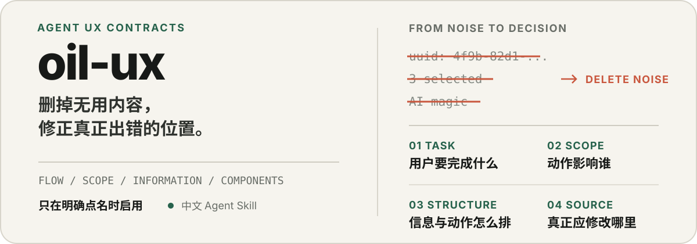

<p align="center">
  
</p>

<p align="center">
  一个只在明确点名时启用的中文 Agent Skill，用于审查、设计和重构产品界面。
</p>

<p align="center">
  <code>UX contracts</code> · <code>Explicit opt-in</code> · <code>MIT</code>
</p>

## 它解决什么

AI 很容易把“做得更多”误认为“设计得更好”：补充无用说明、暴露内部 ID、复述显而易见的状态、把展示页做成表单、在业务页面修补共享组件，或用星星和机器人装饰 AI 功能。

`oil-ux` 提供一套克制的判断顺序，让 Agent 先理解任务、对象和数据范围，再决定该删除什么、该保留什么，以及真正应该修改哪一层。

| 常见偏差 | `oil-ux` 的判断 |
| --- | --- |
| 为已经清楚的流程补充说明 | 结构、控件和反馈能够表达时，不重复写文案 |
| 展示 UUID、内部枚举和系统字段 | 不能帮助识别、判断、操作或排障时删除 |
| 固定显示 `3 selected`、`20 items` | 只有影响下一步动作、作用范围或结果时显示 |
| 把资源浏览页直接做成表单 | 默认使用展示态，明确开始编辑后才出现控件 |
| 在页面里覆盖共享组件样式 | 修复父布局、共享组件或稳定的组件变体 |
| 用星星、机器人或脑形表示 AI | 使用真实动作、对象或结果对应的图标 |
| 因为旧实现已经存在就继续复用 | 旧实现错误时直接修复或替换，并清理旧代码 |

## 工作方式

1. **识别任务**：用户要完成什么，什么结果才算完成。
2. **还原事实**：确认对象、数据来源、作用范围和已有共享实现。
3. **先做删除**：去掉无决策价值的信息、重复动作、伪状态和局部补丁。
4. **选择结构**：按照浏览、比较、选择、编辑或批量配置的真实任务组织界面。
5. **修复源头**：优先修改数据流、父布局和共享组件，不在使用位置反复打补丁。
6. **检查结果**：核对状态、视口、数据范围和所有受影响的共享使用位置。

## 安装

### Codex

```bash
git clone https://github.com/oil-oil/oil-ux.git ~/.codex/skills/oil-ux
```

### Claude Code

```bash
git clone https://github.com/oil-oil/oil-ux.git ~/.claude/skills/oil-ux
```

如果你的 Agent 使用其他 Skill 目录，把仓库克隆到对应目录即可。

## 使用

这个 Skill 不会因为普通的 UI、CSS、表单或组件任务自动触发。请明确点名：

```text
使用 $oil-ux 审查这个页面的信息层级、数据范围和组件实现，并修复问题。
```

也可以限制任务范围：

```text
使用 $oil-ux 只评审这个表单，不修改代码。
```

```text
使用 $oil-ux 重构这个列表和详情页，处理所有共享组件的使用位置。
```

## 规则地图

| 关注点 | 规则 |
| --- | --- |
| 文案、动作、图标和点击区域 | [信息与动作契约](references/information-and-action-contract.md) |
| 图片、名称、区分字段和选择结果 | [资源识别契约](references/resource-recognition-contract.md) |
| 列表、详情、表格和批量操作 | [集合与详情契约](references/collection-and-detail-contract.md) |
| 展示态、编辑态、表单和工作流 | [交互与编辑契约](references/interaction-and-editing-contract.md) |
| 数据集合、操作范围、提交和流程连续性 | [作用域与状态真实性契约](references/scope-and-state-integrity-contract.md) |
| 页面尺寸、滚动、弹窗和浮层 | [视口与弹窗契约](references/viewport-and-dialog-contract.md) · [浮层契约](references/overlay-contract.md) |
| Loading、空状态、错误和长任务 | [状态与加载契约](references/state-and-loading-contract.md) |
| 组件、函数、样式归属和旧实现清理 | [组件契约](references/component-contract.md) |
| 项目原生检查规则 | [自动化契约](references/automation-contract.md) |
| 改动范围检查 | [验证契约](references/verification-contract.md) |

完整入口和执行顺序见 [SKILL.md](SKILL.md)。

## 边界

- 不自动触发，只有用户明确要求使用 `oil-ux` 时才启用。
- 不要求 Agent 自行打开浏览器验证页面。
- 不把键盘操作或无障碍清单作为默认输出重点。
- 不规定具体前端框架、CSS 方案或组件库。
- 不盲从项目历史；既有实现不正确时，可以在授权范围内替换。
- 不为一次小改动强行搭建新的自动化体系。

## 目录

```text
oil-ux/
├── SKILL.md
├── agents/
│   └── openai.yaml
├── references/
│   ├── information-and-action-contract.md
│   ├── resource-recognition-contract.md
│   ├── collection-and-detail-contract.md
│   ├── interaction-and-editing-contract.md
│   ├── scope-and-state-integrity-contract.md
│   ├── viewport-and-dialog-contract.md
│   ├── overlay-contract.md
│   ├── state-and-loading-contract.md
│   ├── component-contract.md
│   ├── automation-contract.md
│   └── verification-contract.md
└── assets/readme/
    └── hero.svg
```

## 贡献

Issue 和 Pull Request 都欢迎。新增规则时请优先说明它解决的通用问题，不要只记录某个页面的偶然样式；使用直接、常见的词，避免重复已有规则。

## License

[MIT](LICENSE)
